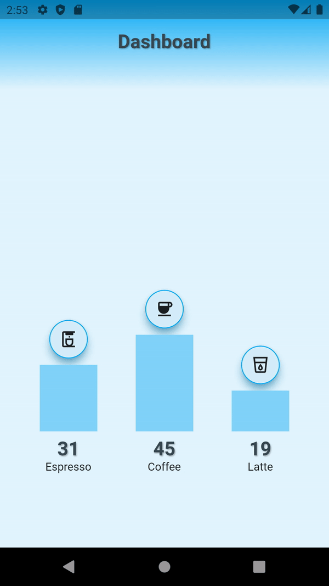

# dashboard_valuenotifier
Dashboard using `ValueNotifier` and `ValueListenableBuilder`.
State Management by using built-in Flutter classes.

## Video Tutorial
[YouTube Video](https://youtu.be/v5WQOLLC0m8)

[Blog](https://jedipixels.dev/flutter-state-management-using-valuenotifier-valuelistenablebuilder)

[GitHub](https://github.com/JediPixels/dashboard_valuenotifier)



## What is covered
In this project, you are going to take a look at:
- How to use `ValueNotifier` and `ValueListenableBuilder` to pass data from a parent (ancestor) widget to child (descendant) widgets in the widget tree
- State Management with build-in classes, no packages

## The Problem:
- Dashboard app needs to chart espresso, coffee, and latte consumption
- Drawing each bar, the chart needs to refresh independently for performance

## The Solution:
- Use the `ValueNotifier` and `ValueListenableBuilder` to allow to selectively rebuild individual widgets for performance


## ValueNotifier and ValueListenableBuilder
The `ValueNotifier` and `ValueListenableBuilder` allow to selectively rebuild individual widgets for performance

1. Create a class that extends `ValueNotifier`
2. Add fields to contain data defining them as `ValueNotifier`
3. Add methods to modify data and call the `notifyListeners()` method
4. Add the `ValueListenableBuilder` widget in the widget tree to rebuild widgets selectively if the data changed by individual field

```
class DashboardSection {
  ValueNotifier<int> numberOfEspresso = ValueNotifier<int>(0);
  ValueNotifier<int> numberOfCoffee = ValueNotifier<int>(0);
  ValueNotifier<int> numberOfLatte = ValueNotifier<int>(0);

  DashboardSection(
      {required this.numberOfEspresso,
        required this.numberOfCoffee,
        required this.numberOfLatte});
}

class DashboardValueNotifier extends ValueNotifier<DashboardSection> {
  DashboardValueNotifier({required DashboardSection value}) : super(value);

  void addNumberOfEspresso(int numberOfEspresso) {
    value.numberOfEspresso.value += numberOfEspresso;
    notifyListeners();
  }

  void addNumberOfCoffee(int numberOfCoffee) {
    value.numberOfCoffee.value += numberOfCoffee;
    notifyListeners();
  }

  void addNumberOfLatte(int numberOfLatte) {
    value.numberOfLatte.value += numberOfLatte;
    notifyListeners();
  }
}

// Child Widget
ValueListenableBuilder(
  valueListenable: dashboardValueNotifier.value.numberOfEspresso,
  builder: (BuildContext context, int value, Widget? child) {
    debugPrint('numberOfEspresso: ${dashboardValueNotifier.value.numberOfEspresso.value}');
      return MoodVerticalBarWidget(
        icon: Icons.coffee_maker_outlined,
        numberToPlot: dashboardValueNotifier.value.numberOfEspresso.value,
        numberToPlotMax: numberToPlotMax,
        title: 'Espresso',
      );
  },
),
```

## How it Works
`ValueNotifier` and `ValueListenableBuilder` - The `ValueNotifier` and `ValueListenableBuilder` allow to selectively rebuild individual widgets for performance. Use fields to contain data defining them as `ValueNotifier`. Use methods to modify data and call the `notifyListeners()` method. Use the `ValueListenableBuilder` widget in the widget tree to rebuild widgets selectively if the data changed by individual field.
